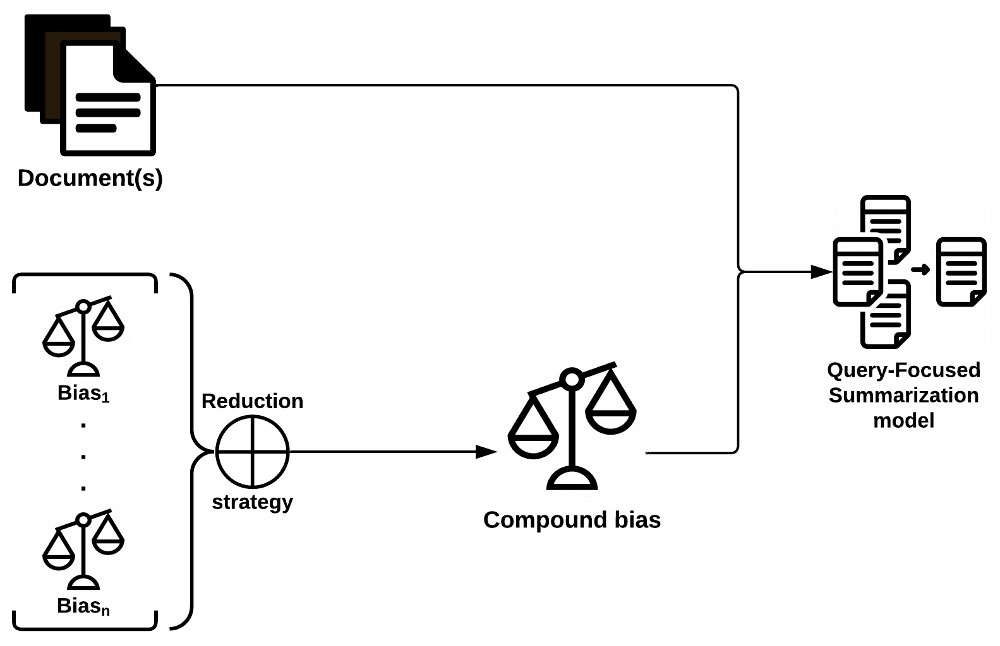

<!-- Improved compatibility of back to top link: See: https://github.com/Ayenem/LDS -->
<a name="readme-top"></a>

<!-- PROJECT LOGO -->
<br />
<div align="center">
  <!--  -->

  <h3 align="center">Multi-Bias TextRank</h3>

  <p align="center">
    Compound Bias-Focused Extractive Summarization
    <br />
    <br />
    <!-- <a href=#usage>View Demo</a> -->
    <!-- · -->
    <!-- <a href="https://github.com/Ayenem/MBTR/issues">Report Bug</a>
    ·
    <a href="https://github.com/Ayenem/MBTR/issues">Request Feature</a> -->
  </p>
</div>


<!-- TABLE OF CONTENTS -->
<details>
  <summary>Table of Contents</summary>
  <ol>
    <li>
      <a href="#about-the-project">About The Project</a>
    </li>
    <!-- <li> -->
      <!-- <a href="#references">References</a> -->
    <!-- </li> -->
    <li>
      <a href="#getting-started">Getting Started</a>
      <ul>
        <li><a href="#prerequisites">Prerequisites</a></li>
        <li><a href="#installation">Installation</a></li>
      </ul>
    </li>
    <li><a href="#usage">Usage</a></li>
    <!-- <li><a href="#license">License</a></li> -->
    <li><a href="#contact">Contact</a></li>
    <li><a href="#acknowledgments">Acknowledgments</a></li>
  </ol>
</details>


<!-- ABOUT THE PROJECT -->
## About The Project

<div align="center">
  
</div>
<!-- [![Product Name Screen Shot][product-screenshot]](https://www.researchgate.net/publication/232645575_Graph-Based_Algorithms_for_Text_Summarization) -->

Current Query-Focused Summarization (QFS) models consider a single input query. Given an arbitrary corpus of text, the query's formulation is burdened with addressing it at various language registers and degrees of specificity.

The Compound Bias-Focused Summarization (CBFS) framework combines the effects of multiple biases, thus partitionning the linguistic and informational constraints. This is analoguous to humans reformulating questions from multiple perspectives or through various language registers for a wider coverage of their audience. Additionally, non-query biases such as sentiment strength can be factored in for Explicative Sentiment Summarization (ESS).

Here, we extend [Kazemi et al. (2020)](https://aclanthology.org/2020.coling-main.144/)’s Biased TextRank model to **Multi-Bias TextRank** to demonstrate the CBFS framework.

<!-- REFERENCES -->
<!-- ## References -->
<!-- Refer to the paper when/if it's accepted -->

<!-- GETTING STARTED -->
## Getting Started

### Prerequisites

[Poetry](https://python-poetry.org/docs/#installing-with-the-official-installer)
```sh
curl -sSL https://install.python-poetry.org | python3 -
```
### Installation

```sh
git clone https://github.com/croesuslab/lab30-summarization-ahmedm/tree/main/models/MultiBiasTextRank
cd MultiBiasTextRank/
poetry install
```

<p align="right">(<a href="#readme-top">back to top</a>)</p>

<!-- USAGE EXAMPLES -->
## Usage

See `test_mbtr.py` and `test_ess_mbtr.py`.

<!-- LICENSE -->
<!-- ## License -->

<!-- Distributed under the MIT License. See `LICENSE.txt` for more information. -->

<p align="right">(<a href="#readme-top">back to top</a>)</p>


<!-- CONTACT -->
## Contact

ahmed.moubtahij.1@ens.etsmtl.ca

<p align="right">(<a href="#readme-top">back to top</a>)</p>


<!-- ACKNOWLEDGMENTS -->
## Acknowledgments

* [Best-README-Template](https://github.com/othneildrew/Best-README-Template)
* [deal](https://github.com/life4/deal)
* [networkx](https://networkx.org/documentation/stable/reference/algorithms/generated/networkx.algorithms.link_analysis.pagerank_alg.pagerank.html)

<p align="right">(<a href="#readme-top">back to top</a>)</p>


<!-- MARKDOWN LINKS & IMAGES -->
<!-- https://www.markdownguide.org/basic-syntax/#reference-style-links -->
[product-screenshot]: images/textrank_graph.png
